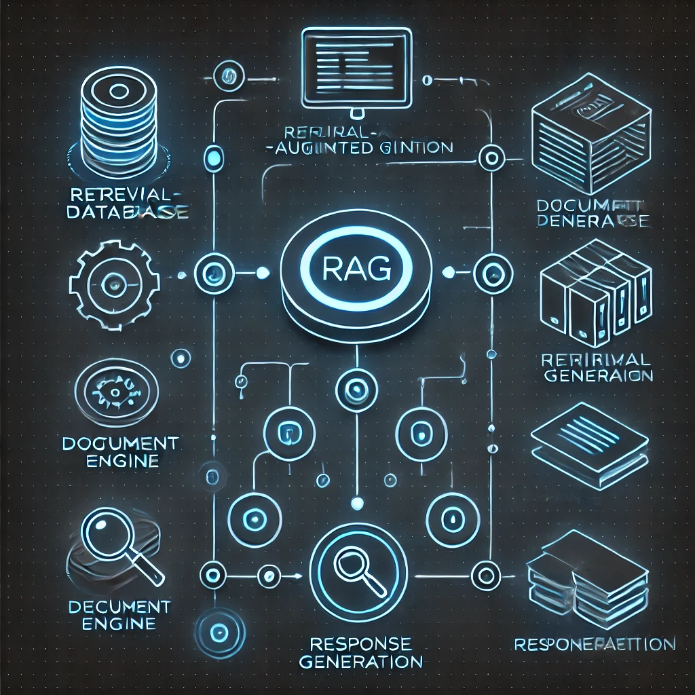

<h1 align="center">PDF Document Q&A System with RAG and Gemini</h1>
<p align="center">
  <em>Intelligent document analysis powered by RAG and Google's Gemini AI</em>
</p>

<table>
  <tr>
    <td width="50%">
      
    </td>
    <td width="50%">
      
    </td>
  </tr>
</table>

<br/>

## Features

- 📄 PDF document processing with automatic chunking
- 💡 Natural language question answering
- 🎯 Source citations with page numbers
- 🔍 AI-powered analysis:
  - Sentiment analysis
  - Topic modeling
  - Key insights extraction
  - Contextual relevance scoring

## Quick Start

### Prerequisites
- Python 3.11+
- Google API key ([Get it here](https://makersuite.google.com/app/apikey))

### Document Placement

You can add documents in two ways:

1. **Through the Web Interface**
   - Use the drag & drop interface
   - Maximum 16MB per file

2. **Manual Placement**
   ```bash
   # Place PDF files directly in the docs folder
   project_root/
   └── docs/
       ├── document1.pdf
       ├── document2.pdf
       └── ...
   ```
   The system will automatically process any PDF files in the docs folder on startup.

### Installation

1. **Setup Environment**
```bash
# Clone and enter directory
git clone <repository-url> && cd <project-folder>

# Create virtual environment
python -m venv venv
source venv/bin/activate  # Windows: venv\Scripts\activate

# Install dependencies
pip install -r requirements.txt
```

2. **Configure API Key**
```bash
# Create .env file in backend directory
echo "GOOGLE_API_KEY=your_key_here" > backend/.env
```

3. **Run Application**
```bash
# Start server
chmod +x start.sh && ./start.sh

# Open in browser
http://localhost:5001
```

## Usage

1. **Upload Documents**
   - Drag & drop PDFs or click to browse
   - Max file size: 16MB per PDF
   - Supports text-based PDFs

2. **Ask Questions**
   - Type your question
   - Get answers with source citations
   - View AI-powered insights

## Configuration

Key parameters can be adjusted in:

```python
# document_processor.py
chunk_size = 800        # Text chunk size
chunk_overlap = 50      # Overlap between chunks

# rag_pipeline.py
k = 8                  # Number of chunks to retrieve
```

## Troubleshooting

Common issues and solutions:

- **Port in Use**: Change port in `start.sh` or kill existing process
- **PDF Errors**: Ensure PDFs are text-based (not scanned)
- **API Issues**: Verify API key and quota limits

## API Endpoints

```bash
POST /api/upload    # Upload PDF files
POST /api/ask      # Query documents
GET  /api/stats    # Get document statistics
```